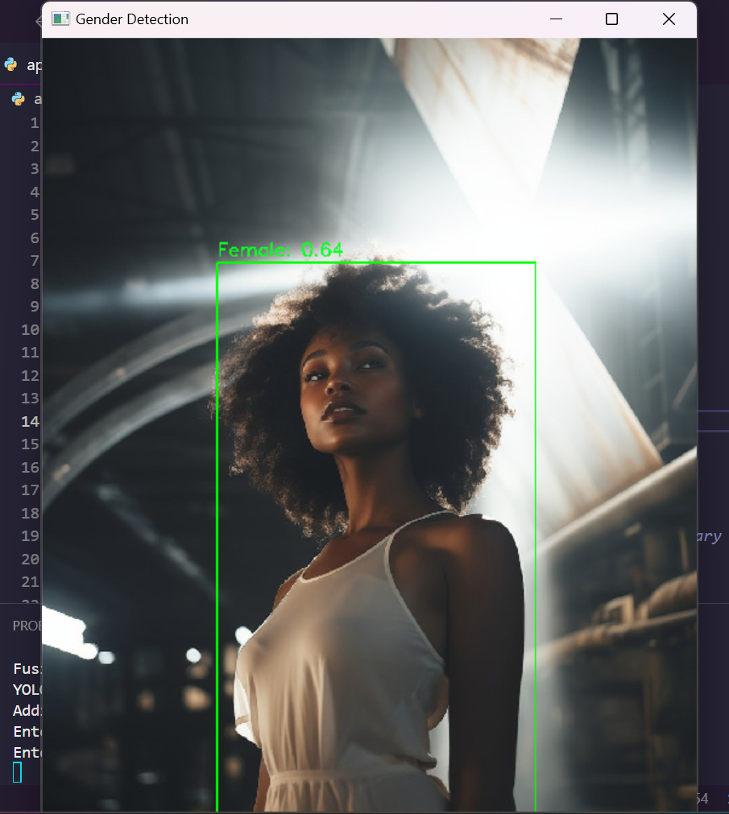

Gender detection using gender classification model

A pre-trained gender classification model(ResNet18) based on a deep learning framework PyTorch is used to predict gender. 

This program captures video frames, uses YOLOv5 to detect persons, and a pre-trained gender classification model to predict and display the gender of each detected person in real-time.

